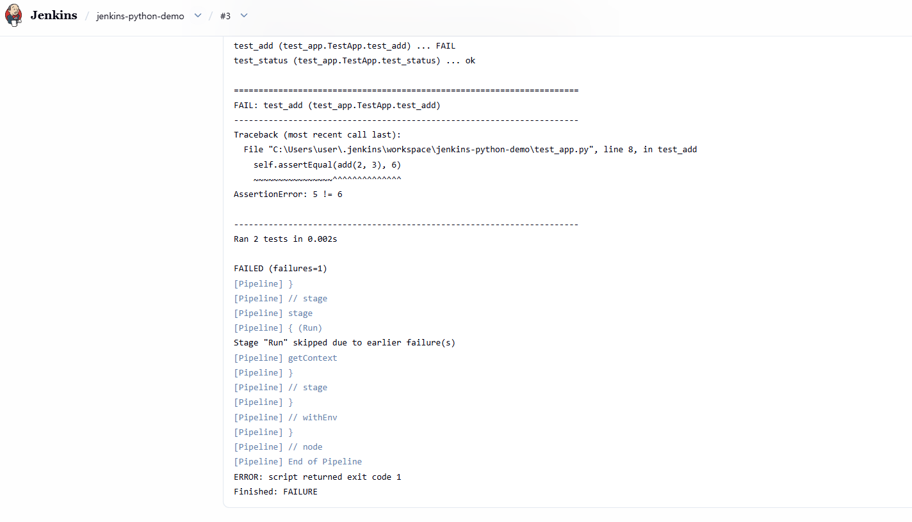
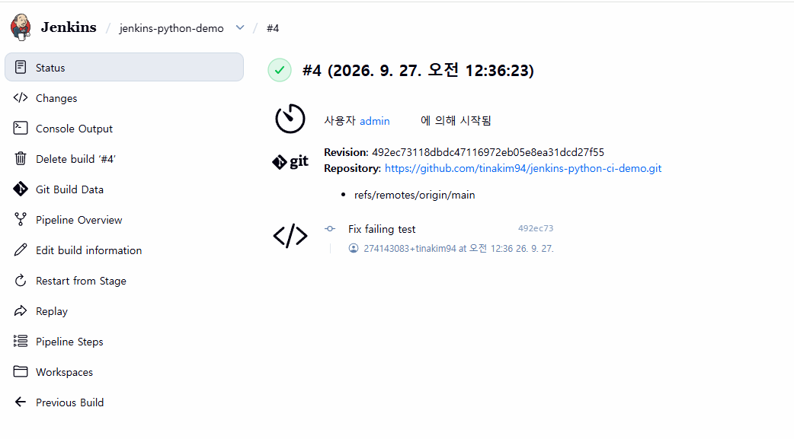

# Jenkins Python CI Demo

GitHub 저장소와 Jenkins를 연동하여 Python 애플리케이션의 테스트를 수행하는
기초 CI Pipeline 실습 프로젝트입니다.

단순히 Jenkins를 설치하는 데 그치지 않고,
테스트 실패 시 이후 Stage가 중단되는 흐름을 확인하고
코드를 수정한 뒤 정상 빌드로 복구하는 과정까지 실습했습니다.

---

## Project Goal

- Jenkins Pipeline 기본 구조 이해
- GitHub 저장소와 Jenkins SCM 연동
- Jenkinsfile 기반 Pipeline 구성
- Python unittest 자동 실행
- 테스트 실패 시 Pipeline 중단 확인
- 코드 수정 후 재빌드를 통한 정상 상태 복구

---

## CI Pipeline

```text
GitHub Repository
        |
        v
Jenkins SCM Checkout
        |
        v
Read Jenkinsfile
        |
        v
      Test
python -m unittest -v
        |
   +----+----+
   |         |
Success    Failure
   |         |
   v         v
  Run      Stop
python     Pipeline
app.py
현재 실습에서는 Jenkins의 `Build Now`를 통해 빌드를 수동으로 실행했으며,
Jenkins가 GitHub의 `main` 브랜치에서 최신 코드를 Checkout한 뒤
저장소의 `Jenkinsfile`을 기준으로 Pipeline을 수행하도록 구성했습니다.

---

## Tech Stack

- Jenkins
- Git
- GitHub
- Python 3
- Python unittest
- Groovy / Jenkinsfile
- Windows

---

## Project Structure

```text
jenkins-python-ci-demo/
├── app.py
├── test_app.py
├── Jenkinsfile
├── .gitignore
├── README.md
└── docs/
    ├── jenkins_failure.png
    └── jenkins_success.png
```

---

## Jenkinsfile

```groovy
pipeline {
    agent any

    stages {
        stage('Test') {
            steps {
                bat 'python -m unittest -v'
            }
        }

        stage('Run') {
            steps {
                bat 'python app.py'
            }
        }
    }
}
```

Pipeline은 두 개의 Stage로 구성했습니다.

### Test

```bash
python -m unittest -v
```

Python unittest를 실행합니다.

테스트가 실패하면 Jenkins가 exit code를 감지하고
Pipeline을 실패 상태로 종료합니다.

### Run

```bash
python app.py
```

Test Stage가 성공한 경우에만 실행됩니다.

---

## Failure Test

Pipeline의 실패 동작을 확인하기 위해 테스트 코드를 의도적으로 변경했습니다.

정상 테스트:

```python
self.assertEqual(add(2, 3), 5)
```

실패 테스트:

```python
self.assertEqual(add(2, 3), 6)
```

Jenkins 실행 결과 다음과 같이 테스트 실패를 감지했습니다.

```text
AssertionError: 5 != 6
FAILED (failures=1)
Stage "Run" skipped due to earlier failure(s)
Finished: FAILURE
```



Test Stage에서 오류가 발생했기 때문에
뒤의 Run Stage는 실행되지 않았습니다.

---

## Recovery

실패 원인을 확인한 뒤 테스트 코드를 정상 값으로 수정했습니다.

```python
self.assertEqual(add(2, 3), 5)
```

수정 사항을 GitHub `main` 브랜치에 Push한 뒤
Jenkins에서 다시 빌드하여 정상 상태로 복구했습니다.



최종 Pipeline 결과:

```text
Test : SUCCESS
Run  : SUCCESS
Build: SUCCESS
```

---

## What I Learned

이번 실습을 통해 다음 과정을 직접 경험했습니다.

- Jenkins 설치 및 Plugin 구성
- Jenkins Pipeline 생성
- Jenkinsfile을 이용한 Pipeline as Code
- GitHub Repository와 Jenkins SCM 연결
- Jenkins Workspace에서 Python 명령 실행
- unittest 기반 테스트 수행
- 테스트 실패에 따른 Pipeline 중단
- Console Output 기반 실패 원인 확인
- 코드 수정 및 Git Push
- Jenkins 재빌드를 통한 정상 상태 복구

특히 빌드 성공뿐 아니라 의도적으로 실패 상황을 만들고,
로그를 통해 원인을 확인한 뒤 수정하여 정상 상태로 복구하면서
CI Pipeline의 기본적인 장애 확인 및 복구 흐름을 실습했습니다.

---

## Repository

https://github.com/tinakim94/jenkins-python-ci-demo